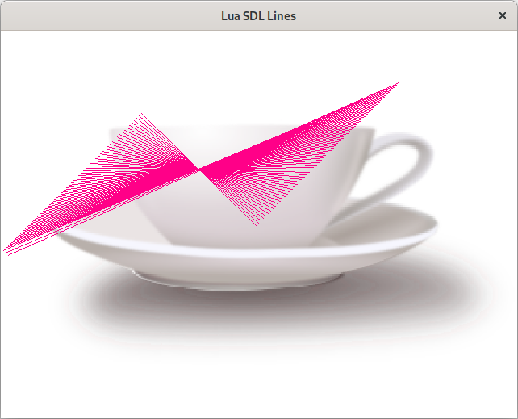

# lua_sdl__lines
Tutorial and demo of using SDL from Lua that shows flying lines over a background image

## Overview

This is an example program for using [SDL2](https://www.libsdl.org/) from Lua.
It uses the SDL2 bindings from https://github.com/Tangent128/luasdl2 .

## Dependencies

Of course you will need Lua installed, and later we will need lua dev package and the luarocks
for installing other dependencies.

    sudo apt install lua5.3
    sudo apt install liblua5.3-dev
    sudo apt install luarocks

You need lua-sdl2 bindings installed.
You can install this with luarocks like this:

    sudo luarocks install lua-sdl2

For that command to succeed you probably need some dependencies
On my test Ubuntu system I needed to install these things first, which also
in turn depend on having a C build chain (i.e. gcc, etc.).

    sudo apt-get install libsdl2-dev
    sudo apt-get install libsdl2-image-dev
    sudo apt-get install libsdl2-mixer-dev
    sudo apt-get install libsdl2-net-dev
    sudo apt-get install libsdl2-ttf-dev

Once you have all the dependencies tracked down you should be able to run the program like so:

    lua lines.lua

And you should see something like this.

I hope this is useful to you.

Please note that the background image is not copyright me and is from openclipart.

